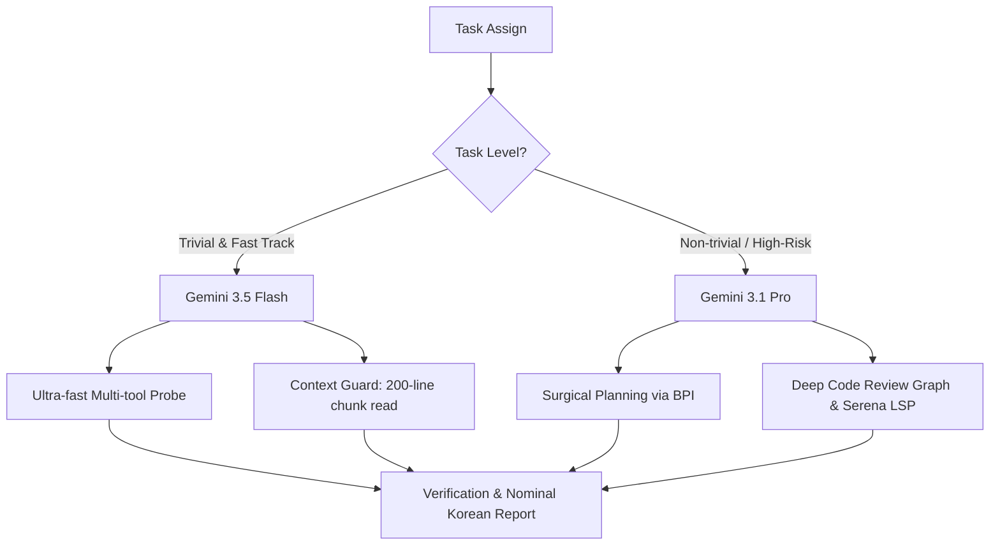

# Proposal: Optimization of AGENTS.md & Workflow for Gemini 3.5 Flash & 3.1 Pro

본 제안서는 **Gemini 3.5 Flash** 및 **Gemini 3.1 Pro**의 도입으로 달라진 에이전트의 물리적 한계와 성능을 최적화하기 위해, 기존 `AGENTS.md`에 반영되어야 할 구체적인 개정안과 아키텍처 규칙을 제시합니다.

---

## 1. 개정 방향 요약



---

## 2. AGENTS.md 개정 세부안

### [신설] `AGENTS.md` 내 'Section 2D. Model-Specific Execution Guidelines (Gemini 3.5 Flash & 3.1 Pro)'

기존 `AGENTS.md`에 다음 섹션을 신설하여 모델 특화 작동 지침을 명시합니다.

```markdown
---

## 2D. Model-Specific Execution Guidelines (Gemini 3.5 Flash & 3.1 Pro)

To maximize the capabilities of the upgraded Gemini engines while strictly controlling token consumption and attention loss, follow these split-role guidelines:

### 1. Gemini 3.5 Flash (Operational Velocity & Diagnostic Engine)
- **Primary Role**: Discovery, log diagnostics, high-speed iteration, and trivial edits.
- **Context Guard**:
  - Despite the huge context window, **DO NOT** read files larger than 500 lines entirely. Use targeted symbol searches or read in 200-line chunks.
  - Prioritize `semble_rs digest` for parsing dense build/test outputs to prevent log-dump context contamination.
- **Workflow Speed**:
  - Leverage ultra-low latency to perform fast, sequential multi-tool probes (e.g., quickly checking 3 different directories using `list_dir` rather than one heavy glob search).
  - Perfect for "Fast Track" tasks.

### 2. Gemini 3.1 Pro (Architectural Rigor & High-Risk Guard)
- **Primary Role**: Complex algorithmic design, monorepo dependency resolution, and standard planning.
- **High-Risk Defense**:
  - Must be utilized when touching Spring Boot Security, OAuth2, Liquibase Migrations, and global Pinia store state transitions.
  - Utilize `code-review-graph` to analyze the blast radius completely before proposing the implementation plan.
  - Enforce the **BPI (Brainstorm -> Plan -> Implement)** workflow in `.agents/skills/superpower/SKILL.md` to ensure logical soundness.
```

---

## 3. `agent-workflow-pipeline.md` 도구 체인 최적화 제안

3.5 Flash와 3.1 Pro의 도구 호출 능력에 맞추어 `agent-workflow-pipeline.md`를 다음과 같이 개정합니다.

### A. Stage 1. Discovery (탐색 단계)
- **3.5 Flash**: 초고속 툴 호출을 이용해 `tree --symbols`와 `search --compact`를 체인 형태로 연달아 실행하여 관련 소스코드의 윤곽을 3초 이내에 포착.
- **3.1 Pro**: 대상 범위가 불명확한 대규모 리팩토링 시 `semble_rs plan`을 사용하여 의미론적 연관 관계를 1차 필터링하고 `code-review-graph`로 진입.

### B. Stage 3. Code Generation (코드 생성 단계)
- **Surgical Edit 강제화**: 3.5 Flash는 코드가 조금만 길어져도 중간 부분을 생략하거나 임의 리팩토링할 위험이 있으므로, 코드 작성 도구(`replace_file_content` 또는 `multi_replace_file_content`) 사용 시 **변경 대상 범위 앞뒤 5라인의 컨텍스트를 정확하게 매칭**하여 surgical edit 규칙을 100% 충족하도록 제한함.

---

## 4. 한국어 보고서(Korean Protocol) 작성 템플릿 제안

모델 성능이 고도화될수록 장황한 자연어가 출력되므로, 답변의 가장 첫 부분에 명사형 종결어조로 구성된 핵심 메타데이터 블록을 배치하도록 강제합니다.

### 표준 메타데이터 요약 블록 템플릿
```markdown
### 📊 작업 요약
- **수행 모델**: [Gemini 3.5 Flash / Gemini 3.1 Pro]
- **작업 상태**: [대기 / 분석 완료 / 수정 완료 / 검증 완료]
- **영향 파일**: `AGENTS.md`, `docs/agent-log/...`
- **검증 여부**: [성공 (Exit Code 0) / 미실행]
```
이 템플릿을 사용하여 에이전트의 답변 상단 가독성을 극대화합니다.
