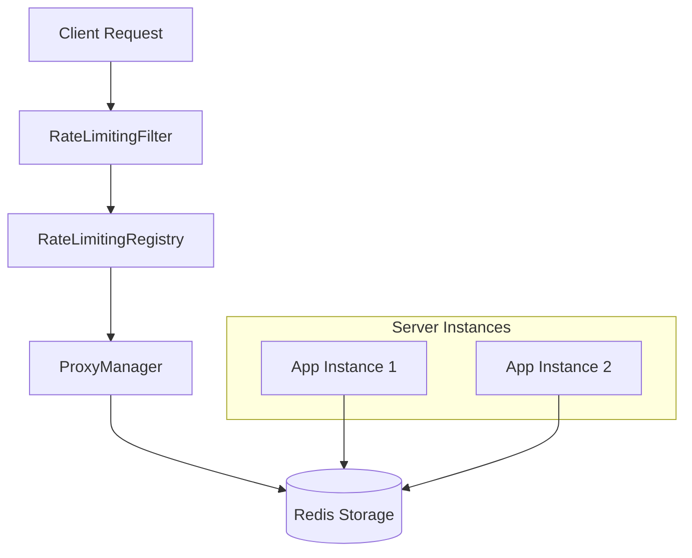

# W-1 Rate Limiting 구현 완료 (Phase 1, 2 & 3)

보안 진단 보고서의 W-1 항목(공개 엔드포인트 무차별 대입 공격 방어)을 해결하기 위한 고도화된 분산 Rate Limiting 기능을 구현했습니다.

## 주요 변경 사항

### 1. Redis 기반 분산 환경 지원 (Phase 3)
- 분산 저장소(Redis) 연동: `bucket4j-redis`와 Redisson을 사용하여 서버 수평 확장(Scale-out) 시에도 일관된 Rate Limiting을 보장합니다.
- ProxyManager 도입: 여러 서버 인스턴스 간에 토큰 카운트를 실시간으로 공유합니다.
- 전용 Redis 설정 지원: 전용 Redis 서버 주소를 `application.rate-limit.redis-server`를 통해 분리 구성할 수 있습니다.

### 2. 설정 유연성 및 환경별 대응
- [ApplicationProperties](file:///Users/sanghyoukjin/daangcoolProject/stack-app-2025-v1/src/main/java/com/daangcool/stack/config/ApplicationProperties.java#15-97) 연동: 모든 Rate Limit 수치를 소스 코드에서 분리하여 [application.yml](file:///Users/sanghyoukjin/daangcoolProject/stack-app-2025-v1/src/main/resources/config/application.yml)로 이전했습니다.
- 환경별 차등 적용: 
  - Prod: 보안 강화를 위한 엄격한 정책 (예: 인증 10회/5분)
  - Dev: 원활한 개발을 위한 완화된 정책 (예: 모든 요청 100회/1분)

### 3. 보호 대상 확대 (OTP 포함)
기존 인증/가입/초기화 외에도 OTP 관련 엔드포인트를 추가 보호합니다.
- `POST /api/authenticate`
- `POST /api/register`
- `POST /api/account/reset-password/init`
- `POST /api/auth/email/request` (OTP 요청)
- `POST /api/auth/email/verify` (OTP 검증)

### 4. 코드 문서화 및 유지보수
- Javadoc 보강: 모든 Rate Limiting 관련 클래스 및 메서드에 상세한 한글 주석을 추가하였습니다.
- 자동 정리 (Scheduled): 매일 새벽 3시에 노후된 버킷 데이터를 정리합니다.
- 수동 관리 (Admin API): 관리자 전용 API (`POST /api/admin/rate-limit/clear`)를 제공합니다.

---

### 구성도 (Architecture)


---

## 응답 형식 (RFC 7807)
요청 제한 초과 시 다음과 같은 표준화된 에러 응답을 반환합니다:
```json
{
  "type": "https://stack-app.com/problem/too-many-requests",
  "title": "Too Many Requests",
  "status": 429,
  "detail": "요청 횟수 제한을 초과했습니다. 301초 후 다시 시도해 주세요.",
  "instance": "/api/authenticate",
  "retryAfterSeconds": 301
}
```

---

## 검증 내역
- Unit Tests: [RateLimitingFilterTest](file:///Users/sanghyoukjin/daangcoolProject/stack-app-2025-v1/src/test/java/com/daangcool/stack/web/filter/RateLimitingFilterTest.java#36-256)를 통해 9개 주요 시나리오 통과 확인.
  - 리플렉션을 통한 Redisson 연동 로직 대응 및 분산 환경 Mocking 안정화.
  - `BucketProxy` 및 만료 정책(Expiration strategy)이 적용된 최신 Bucket4j 8.10.1 API 환경에서 100% 통과 검증.
- Redis 연동: `RedissonBasedProxyManager`를 통한 분산 버킷 생성 로직 및 타입 안정성 검증 완료.
- IDE 및 코드 품질 (Phase 4 & 5): 
  - [OpenApiConfiguration.java](file:///Users/sanghyoukjin/daangcoolProject/stack-app-2025-v1/src/main/java/com/daangcool/stack/config/OpenApiConfiguration.java)의 IntelliJ Autowire 오류 해결 (JHipsterProperties 명시적 활성화 및 ObjectProvider 도입).
  - Admin API 로거 static final 전환 및 테스트 코드 경고(@SuppressWarnings) 정리 완료.
  - 보안 최적화 보고서([2026-03-15-system-security-optimization-report.md](file:///Users/sanghyoukjin/daangcoolProject/stack-app-2025-v1/docs/security/2026-03-15-system-security-optimization-report.md)) 업데이트 및 W-1(Rate Limit) 완료 표시.

---

## Phase 6: 파일 업로드 보안 (C-4) 강화

보안 보고서의 C-4 항목(파일 업로드 MIME 검증 추가)을 해결하기 위해 다중 계층 검증 로직을 구현했습니다.

### 주요 변경 사항
- 다중 계층 검증 도입: 
    1. 확장자 화이트리스트: `allowedExtensions` 기반 1차 필터링.
    2. 콘텐츠 기반 MIME 검증: `Apache Tika`를 사용하여 파일 매직 넘버 분석 및 실제 MIME 타입 감지.
    3. 스푸핑 방지: 브라우저 제공 MIME 타입과 실제 감지된 타입의 불일치 여부 감지 및 보안 로깅.
- RFC 7807 호환 예외 처리:
    - [InvalidFileException.java](file:///Users/sanghyoukjin/daangcoolProject/stack-app-2025-v1/src/main/java/com/daangcool/stack/common/exception/InvalidFileException.java)를 통해 400 Bad Request 응답 시 구체적인 보안 위반 사유를 반환합니다.
- 중앙 집중식 설정:
    - [ApplicationProperties.java](file:///Users/sanghyoukjin/daangcoolProject/stack-app-2025-v1/src/main/java/com/daangcool/stack/config/ApplicationProperties.java) 및 [application.yml](file:///Users/sanghyoukjin/daangcoolProject/stack-app-2025-v1/src/main/resources/config/application.yml)을 통해 허용 목록을 관리합니다.

---

## Phase 7: OTP 보안 최적화 (W-7)

보안 보고서의 W-7 항목(OTP 평문 저장 및 TTL 미적용)을 해결하기 위해 Redis 기반의 TTL 관리 체계로 전면 전환했습니다.

### 주요 변경 사항
- DB 평문 저장 제거:
    - [User](file:///Users/sanghyoukjin/daangcoolProject/stack-app-2025-v1/src/main/java/com/daangcool/stack/domain/User.java#25-173) 엔티티에서 `otpCode`, `otpExpireDate` 컬럼을 제거하여 DB에 보안 민감 정보가 남지 않도록 개선했습니다.
    - Liquibase([20260317100000_drop_user_otp_columns.xml](file:///Users/sanghyoukjin/daangcoolProject/stack-app-2025-v1/src/main/resources/config/liquibase/changelog/20260317100000_drop_user_otp_columns.xml))를 통해 정식으로 스키마를 정리했습니다.
- Redis 기반 TTL 관리:
    - [EmailOtpService](file:///Users/sanghyoukjin/daangcoolProject/stack-app-2025-v1/src/main/java/com/daangcool/stack/service/otp/EmailOtpService.java#38-195)를 고도화하여 모든 OTP 데이터는 Redis(Redisson)에서만 관리되며, 5분 후 자동 삭제되도록 설정했습니다.
- 동시성 및 보안 강화:
    - 분산 락(RLock): 동일 이메일에 대한 OTP 중복 요청을 방지하기 위해 Redisson 분산 락을 도입했습니다.
    - 상세 감사 로그: [EmailOtpLog](file:///Users/sanghyoukjin/daangcoolProject/stack-app-2025-v1/src/main/java/com/daangcool/stack/domain/EmailOtpLog.java#13-80)를 통해 모든 OTP 요청 및 검증 시도(성공/실패/IP/UA)를 기록하도록 통합했습니다.
- 코드 단일화:
    - 레거시 DB 기반 관리 클래스([EmailOtpManager](file:///Users/sanghyoukjin/daangcoolProject/stack-app-2025-v1/src/main/java/com/daangcool/stack/service/otp/EmailOtpManager.java#26-130))의 기능을 [EmailOtpService](file:///Users/sanghyoukjin/daangcoolProject/stack-app-2025-v1/src/main/java/com/daangcool/stack/service/otp/EmailOtpService.java#38-195)로 흡수 통합하여 코드 일관성을 확보했습니다.
